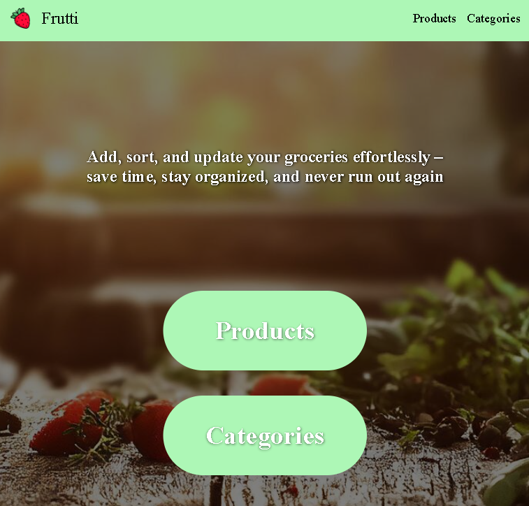
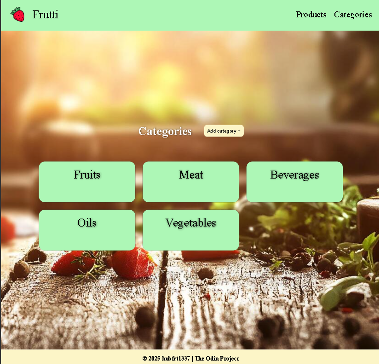
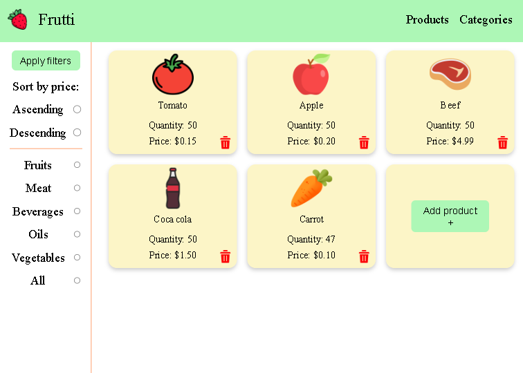

# 🛒 Grocery Inventory Frutti

A web application for managing grocery products.  
It allows you to add, edit, and delete products, as well as manage product categories.  
The project is built with **Express.js**, using **EJS**, **pg**, **Multer**, and **Dotenv**.

---

## ✨ Features
- ➕ Add new products
- ✏️ Update existing products
- 🗑️ Delete products
- 📂 Add and manage product categories
- 📦 Store data in PostgreSQL
- 🖼️ Upload product images (Multer)
- 🔐 Environment configuration via `.env`

---

## 🛠️ Technologies
- [Express.js](https://expressjs.com/) – Node.js framework
- [EJS](https://ejs.co/) – templating engine
- [pg](https://node-postgres.com/) – PostgreSQL client
- [Multer](https://github.com/expressjs/multer) – file upload handling
- [Dotenv](https://github.com/motdotla/dotenv) – environment variable management

---

## Live preview

https://grocery-inventory-five.vercel.app/

